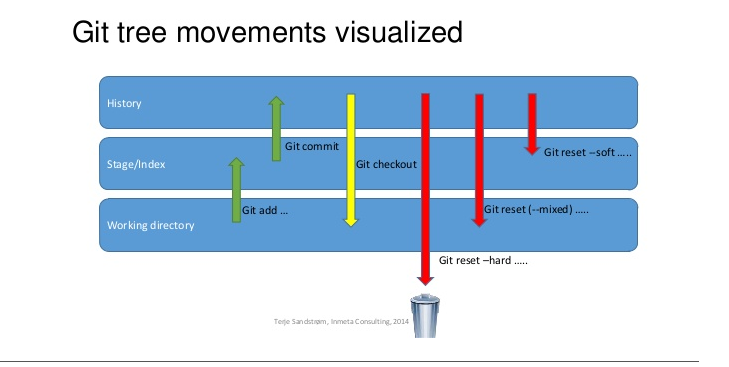

# GIT 사용

#### 커밋 메시지 = '이름 - 커밋내용 - 이슈ID'

### 대략적인 브랜치 구조

- master(개발중에는 직접 push x,  develop branch를 통해서 merge!)

  - develop (master와 마찬가지로 개발중에는 직접 push x, 각각 하위 브랜치로 부터 merge!)

    > 하루를 시작할때 

    - feature/기능명 (개발중 push하는 곳, 정상 작동시 develop 에 merge request)

      **`merge request` 보낼시**

      **병합될 상위 브랜치를 최신화 시킴**

      > 최신화 부분은 확실하진 않아서 한번 확인해보겠습니다 

      담당자가 확인 후 **`merge`** 여부 결정!

#### merge 후 되돌리고 싶을때

- Merge Requests 탭 에 있는 Merged 에서 해당하는 작업을 클릭한 후
- **`Revert`** 버튼 클릭 => 해당 형상에 관련된 브랜치가 새로 생김(추측,,,)
- 생긴 브랜치와 되돌리고 싶은 브랜치를 **`merge`**

#### 현재 작업 중이 branch를 되돌리고 싶을 때

1. reset을 이용한 방법

   > git reset 옵션 커밋ID

   

   1. hard : 모든 것이 다 바뀜(local 에 있는 파일들 까지 다)
   2. mixed : 로컬에 있는 파일들은 다 바뀌지만 add 는 되어있는 상태로 돌아감
   3. soft : add. 까지는 되어 있지만 commit 은 안되어 있는 상태로 돌아감
   4. 옵션 지정 안할시 default 는 mixed

   

2. revert를 이용한 방법

   > git revert 커밋ID

   해당하는 상태로의 커밋을 다시 만들어주는 개념(확실하진 않음..)

   - 커밋을 싹다 날려버리는게 아니기 때문에 더 안정적이라고 생각합니다