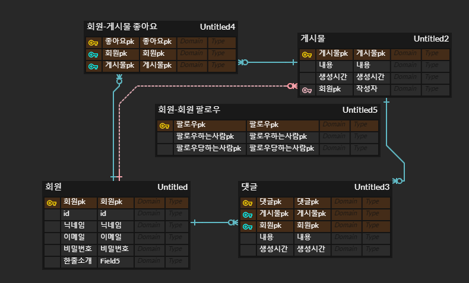

# DB 모델 설명

### 회원, 게시물 테이블의 관계

1. 작성자 표시를 위해 1:N 관계 구현
   - 구현방법
     회원PK를 FK로 가져와서 구현
2. 좋아요를 위해 M:N 관계로 구현
   - 구현방법
     회원-게시물 테이블을 생성 => 좋아요 테이블
     좋아요 테이블은 게시물과 회원과 각각 1:N 관계를 형성하여 좋아요 db 구현

### 회원, 댓글 테이블의 관계

1. 작성자 표시를 위해 1:N 관계 구현

   - 구현방법
     회원PK를 FK로 가져와서 구현

   

### 게시물, 댓글 테이블의 관계

1. 게시물에는 여러개의 댓글이 존재 가능 => 1:N
   - 구현방법
     게시물 PK를 FK로 가져와서 구현

### 회원,회원 테이블의 관계

1. 팔로우 기능이 필요 회원 테이블 간의 M:N관계 요구

   - 구현방법
     좋아요 기능과 마찬가지로 새로운 테이블은 팔로우 테이블을 생성하여 구현

     팔로우당하는사람, 팔로우하는사람을 회원PK를 가져와서 FK로 사용

